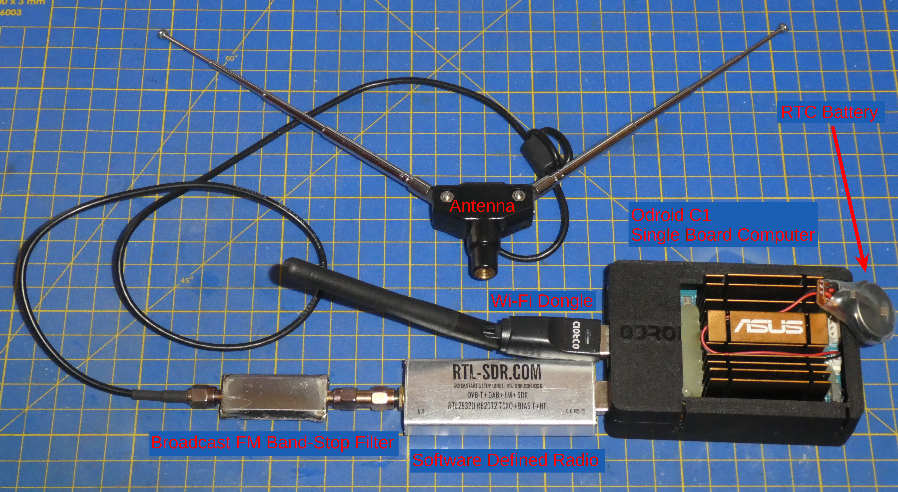

# SBC Playground Readme
## About this project
The following scripts are meant to be run on a Single Board Computer (SBC) like the Raspberry Pi.

## Hardware Descripton

On the below image you can see my setup, I'm using an Odroid C1 SBC, attached to it an RTL-SDR v3 module, a band stop filter for broadcast FM and an antenna.
The antenna in the image is for ADSB, for other use-cases I use different antennas that are destined for the given frequency.
As the Odroid does not have an internal WiFi interface I use a WiFi-USB dongle for network connectivity or an ethernet cable when available.

## Description of the Scripts
### misc
#### pingReboot
    There was an issue with the system that it lost the network connection sometimes and only a reboot helped. This script monitors if it has connection to the local rooter and reboots the system if it looses it. The script needs to be added in systemd so it's started after every startup.

#### tempLogger
    A simple script which logs the CPU temperature so I could test the cooling.

### sdr

These scripts need a Software Defined Radio (SDR)

#### satellite subfolder
    Two variants of the same script one for tracking the International Space Station (ISS) and starting a recording when it's overhead (created for SSTV events). The other is for NOAA weather satellite data capture (APT protocol).

#### scanning subfolder
    run-rtl-power_lora.sh logs the radio activity for the lora radio band into a csv file, this file can be used to create a heatmap of the band activity.

#### wspr subfolder
    Starts a receiver for Weak Signal Propagation Reporter (WSPR) network and uploads the spots to the wspr database. It's useful for checking radio signal propagation.

